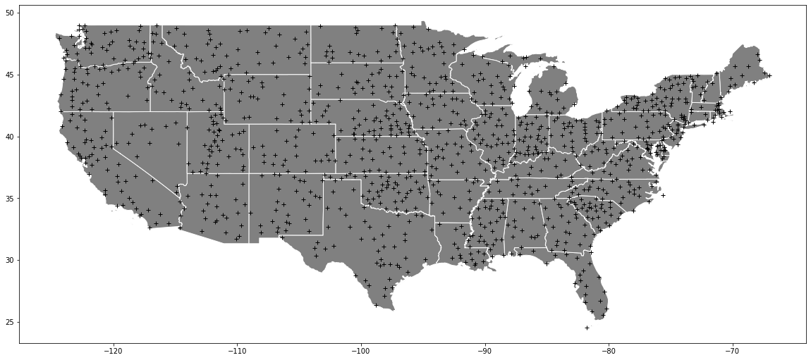
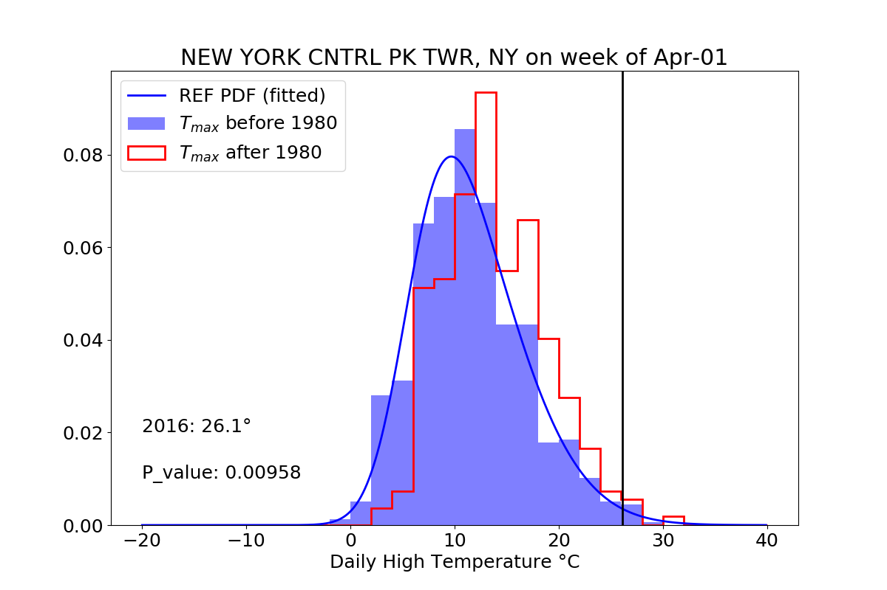
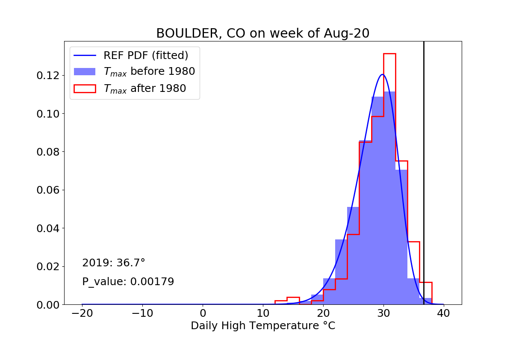
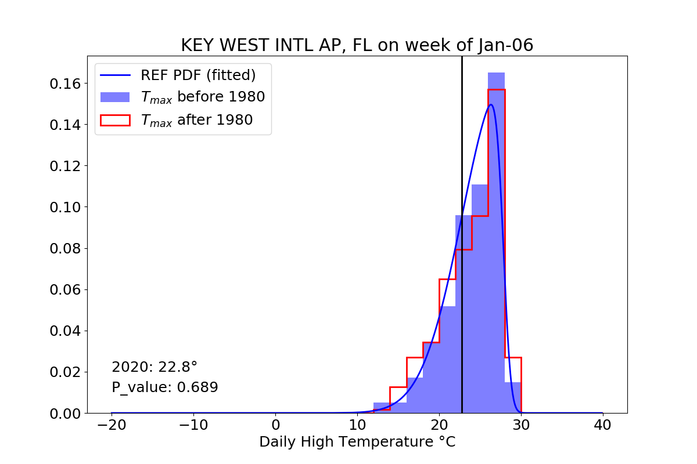

# Climate or Weather?

  

## Test Hypothesis that High Temperature Observation is just a result of weather variability

*Capstone I Project for Galvanize Data Science Immersive, Week 4*

*by Paul Miles*

## Table of Contents
- [Overview](#overview)
  - [Background](#background)
  - [The Data](#the-data)
  - [Question and Hypothesis](#question-and-hypothesis)
  - [Methodology](#methodology)
- [Exploratory Data Analysis](#exploratory-data-analysis)
- [Results](#results)
- [Web App](#web-app)

# Overview

## Background

Weather is highly variable and people are prone to recency bias.

  

Is the current weather you are experiencing "normal" or a consequence of climate change?

## The Data

Data are sourced from the NOAA - Historical Climatology Network
(https://www.climate.gov/maps-data/dataset/daily-temperature-and-precipitation-reports-data-tables)

## Question and Hypothesis

Are the weather conditions at a given day and location a result of climate change or normal variability?

## Methodology

Null Hypothesis: even extreme weather is part of normal variability.
Alternative Hypothesis: or seemingly unusually high temperatures are a sign of warming
Significance level: alpha = 2%
Statistical Test: against a fitted skew-normal distribution from pre-1980 observations

[Back to Top](#Table-of-Contents)

# Exploratory Data Analysis

### Stations

Use the 1,225 weather stations that are part of the NOAA - US Historical Climate Network

  

### Date Range

Typically mid-1800's to present

### Observation Categories

* Core Elements

       PRCP = Precipitation (tenths of mm)
       SNOW = Snowfall (mm)
       SNWD = Snow depth (mm)
       TMAX = Maximum temperature (tenths of degrees C)
       TMIN = Minimum temperature (tenths of degrees C)
* Additional Elements

       average cloudiness, wind direction and speed, percent possible sun
       weather type, weather in vicinity (fog, thunder, rain, snow)

[Back to Top](#Table-of-Contents)

# Results

  
  

# Web App

     
    <a href="http://3.134.110.25:8080/"> Climate or Weather? Web-App </a>

Access AWS Instance command
ssh -i "~/.ssh/instancekey.pem" ec2-user@ec2-3-134-110-25.us-east-2.compute.amazonaws.com

  

[Back to Top](#Table-of-Contents)