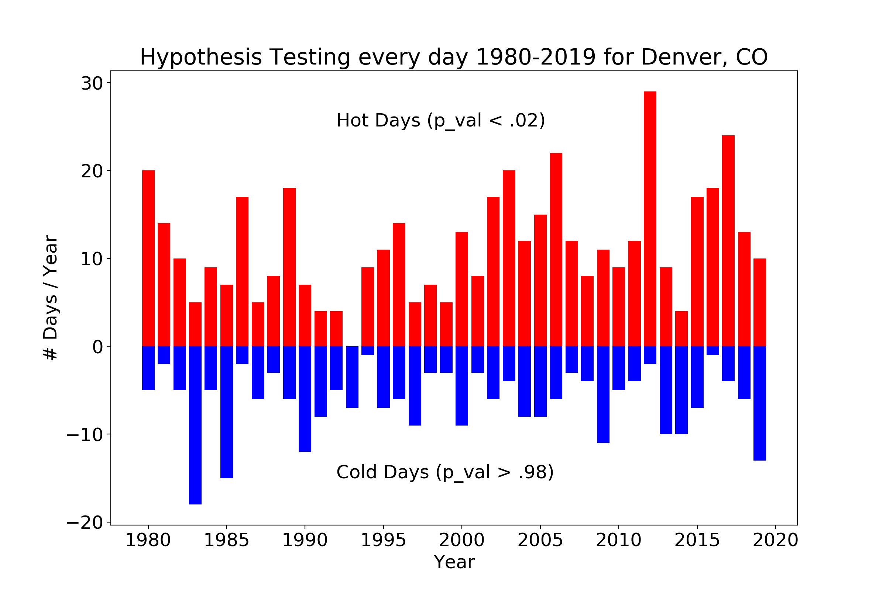

# Climate Change or Just Weather?

<p align="center">
  
</p>

*Capstone I Project for Galvanize Data Science Immersive, Week 4*

*by Paul Miles*

# Web-App

<p style="border:3px; border-style:solid; border-color:#FF0000; padding: 1em;" align="center">
  <a href="http://3.134.110.25:8080/"> Climate or Weather? </a>
</p>


# Table of Contents
- [Overview](#overview)
  - [How to Run](#how-to-run)
  - [Project Question](#project-question)
  - [The Data](#the-data)
  - [Methodology](#methodology)
- [Exploratory Data Analysis](#exploratory-data-analysis)
- [Results](#results)
- [Analysis](#analysis)


# Overview

## How to Run

### Click the link at the top of the page to use the web-app.

Fork this repo and download the raw data

```unix
> cd repo/data
> ftp ftp.ncdc.noaa.gov/pub/data/ghcn/daily/
> get ghcnd_hcn.tar.gz
> (ctrl-d)
> tar -xvf ghcnd_hcn.tar.gz
```

From conda python-3 environment 
Additional dependencies: 
```
> pip install geopandas, pygeo
> python app.py
```

Owner Info:
Access AWS Instance command
ssh -i "~/.ssh/instancekey.pem" ec2-user@ec2-3-134-110-25.us-east-2.compute.amazonaws.com


## Project Question

Weather is highly variable and people are prone to recency bias.  
Do you trust your sense when you feel like it's hotter than it used to be?

<p align="center">
  
</p>

Use the web-app to see the historical temperature distributions at a given location and date.
and mathematically test if those conditions are "normal" or a consequence of climate change?

## The Data

Data are sourced from the NOAA - Historical Climatology Network
(https://www.climate.gov/maps-data/dataset/daily-temperature-and-precipitation-reports-data-tables)

Start with the most extensive and valid data to support project outcomes.

### Data pipeline
* Each file is all historical observations for a given station
* Each line is a month of a particular element
* Must process data into usable format using pandas
* DataFrame with each row a day and each column is an observation (i.e. TMAX)


## Methodology

Null Hypothesis: even extreme weather is part of normal variability.

Alternative Hypothesis: or seemingly unusually high temperatures are a sign of warming

Significance level: alpha = 2%

Statistical Test: against a fitted skew-normal distribution from pre-1980 observations

To capture trends a reference period of pre-1980 is used to segment the data.
For improved statistical significance include all observed high temperatures for week +/- 3 days.
A t-test that assumes a normal distribution is inappropriate, see analysis below for justification.

Results do not prove climate change and don't attempt to.  At most the p-value could
suggest that the observation is not likely a result of normal weather variability (the null hypothesis).

[Back to Top](#Table-of-Contents)

# Exploratory Data Analysis

### Stations

Use the 1,225 weather stations that are part of the NOAA - US Historical Climate Network

<p align="center">
  
</p>

Select nearest station to point of interest.

### Date Range

Typically mid-1800's to present, NOAA has filled in core observiations that pre-date station.
Occasionally stations close and the record stops, also dropped observations occur.
Basic error handling included.

### Observation Categories

* Core Elements

       PRCP = Precipitation (tenths of mm)
       SNOW = Snowfall (mm)
       SNWD = Snow depth (mm)
       TMAX = Maximum temperature (tenths of degrees C)
       TMIN = Minimum temperature (tenths of degrees C)
* Additional Elements

       average cloudiness, wind direction and speed, percent possible sun
       weather type, weather in vicinity (fog, thunder, rain, snow)

"Future Work" would include other elements and cumulants (i.e. heating degree days).

[Back to Top](#Table-of-Contents)

# Results

An example to illustrate the web-app output.
For New York City on an unseasonably warm day 2016-04-01

* Solid blue: histogram from reference data pre-1980.  See Methodology
* Blue line - ref distribution fitted with skew-normal
* Red: histogram of 1980-present

In this rightward shift is indicative of a warming trend since 1980.

p-val of 1% suggests that the null-hypothesis is unlikely

<p align="center">
  
</p>

A second example during the heat wave in Denver last summer.

<p align="center">
  
</p>

[Back to Top](#Table-of-Contents)

# Analysis

Number of days in a year with p-val exceeding set signficance level

<p align="center">
  
</p>

[Back to Top](#Table-of-Contents)

# Extra

Just to feel jealous

<p align="center">
  
</p>

[Back to Top](#Table-of-Contents)